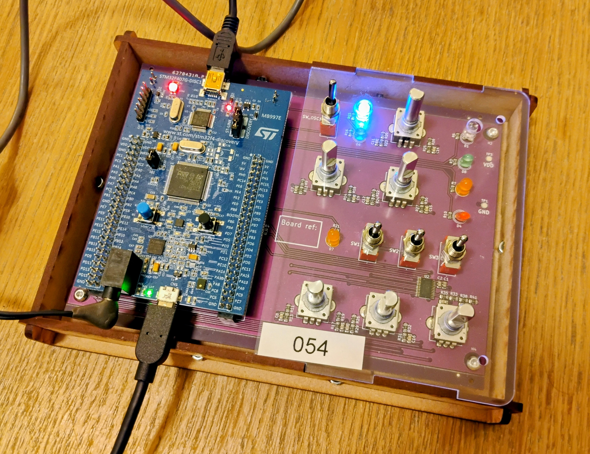

# disco-synth

A synthesizer I wrote as an assignment for the [Real-Time Systems][1] course
at TU Delft. It targets a custom board given to us as part of the course which
has the [STM32F407 Discovery board][2] as its brains, clubbed with the
following peripherals:

- PCM9555 I/O expander
- Rotary encoders for changing the sound characteristics
- DPST switches acting as three position switches to switch the modes

> Refer to the [course website][3] for more details.

It makes full use of the Zephyr framework including, but not limited to:

- Out-of-tree device drivers[^1]
- Devicetree bindings for custom software constructs

## Usage

1. Flash the firmware as you would for any other Zephyr project[^2].
2. Hook up the USB OTG port of the discovery board to the PC and a UART adapter
   should appear on the PC.
3. Open a UART session (`115200N1`) which will drop you into the `synth-shell`.
   Each key press would output a musical note via the onboard TRRS jack. Play
   around with the switches and encoders as specified on the [course website][3].

[1]: https://cese.ewi.tudelft.nl/real-time-systems/
[2]: https://www.st.com/en/evaluation-tools/stm32f4discovery.html
[3]: https://cese.ewi.tudelft.nl/real-time-systems/assignment_b/synthesizer.html

[^1]:
    CS43L22 support is not present upstream yet, so the current driver borrows
    [titouanc's work](https://github.com/titouanc/zephyr-1/pull/3) with minor fixes.

[^2]: Tested with Zephyr v3.7 (LTS).
